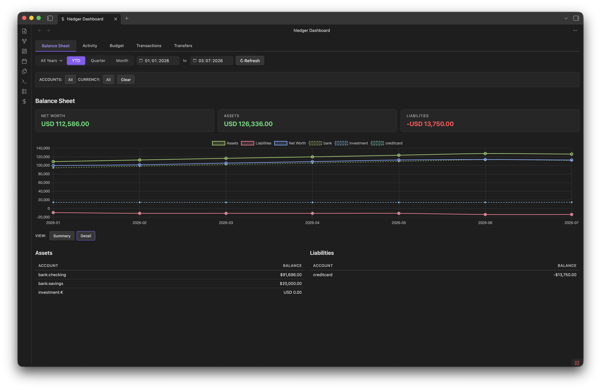

# hledger Dashboard

Full financial dashboard for [hledger](https://hledger.org) journals, inside Obsidian.



## Features

| Tab               | Description                                                                                                                            |
| ----------------- | -------------------------------------------------------------------------------------------------------------------------------------- |
| **Balance Sheet** | Net worth, assets, liabilities KPIs + multi-month trend chart + summary/detail tables with price conversion                            |
| **Activity**      | Income vs expenses KPIs, monthly trend chart, expense breakdown (doughnut + table, groups or atomic), income breakdown                 |
| **Budget**        | Budget vs actual KPIs, bar chart, per-category table with remaining & % used, **forecast projection** into future months               |
| **Transactions**  | Searchable, sortable, paginated register with inflow/outflow/net KPIs, expense/income/liabilities doughnut charts, credit/debit filter |
| **Transfers**     | Track movements between accounts (`equity:transfer`), monthly volume bar chart, history with direction filter (in/out)                 |

## Requirements

- Obsidian Desktop (requires `child_process` / shell access)
- [hledger](https://hledger.org) **1.52+** installed and available on PATH

## Installation

### Manual

1. Download the latest release from the [releases page](https://github.com/cousine/hledger-dashboard/releases).
2. Extract `main.js`, `manifest.json`, `styles.css` into `your-vault/.obsidian/plugins/hledger-dashboard/`.
3. Enable the plugin in **Settings → Community plugins**.
4. Open **Settings → hledger Dashboard** and configure the journal file path.

### BRAT (optional — early access / pre-release)

Use this if the plugin hasn't yet been approved for the community store, or if you want to try the latest unreleased changes between official releases. Requires the [BRAT](https://obsidian.md/plugins?id=obsidian42-brat) plugin.

1. Install BRAT via **Settings → Community plugins → Browse**.
2. Add the repository `cousine/hledger-dashboard` via **Add a beta plugin**.
3. Enable **hledger Dashboard** in Community plugins.

## Quick Start

1. Enable the plugin and click the **$** icon in the ribbon bar (or run `Open hledger Dashboard`).
2. A setup card with step-by-step guidance appears:
   - Click **Open Settings** to configure your **Journal file** path and **Target currency**.
   - Click **Refresh** to load your dashboard once configured.
3. Just exploring? Click **Load sample journal** on the setup card — the plugin writes a sample dataset
   (USD + EUR, ~2.5 years) to your vault root and loads the dashboard immediately.

## Dashboard Tabs

### Balance Sheet

- **KPIs**: Net Worth, Assets, Liabilities (in target currency)
- **Chart**: Multi-month line chart of assets, liabilities, and net worth trends
- **Tables**: Side-by-side assets & liabilities with **Summary** (depth 1) / **Detail** (leaf accounts) toggle
- **Stock accounts**: Accounts with non-currency commodities are converted using market prices

### Activity

- **KPIs**: Income, Expenses, Net for the selected period
- **Trend**: Monthly income vs expenses line chart (appears for multi-month periods)
- **Breakdown**: Expense doughnut chart + sortable table with **Groups** / **Atomic** views and percentage of total
- **Income**: Income sources table (clicking expense rows navigates to the Transactions tab filtered by that account)

### Budget

- **KPIs**: Budget, Actual, Remaining totals
- **Chart**: Bar chart comparing budget vs actual per category
- **Table**: Per-category rows with Budget, Actual, Remaining, % Used
- **Forecast**: Projected asset & expense monthly trends using past actuals + budget assumptions. Requires periodic transactions (`~ monthly`) in your journal

### Transactions

- **KPIs**: Inflow, Outflow, Net
- **Breakdown doughnuts**: Expenses, Income, Liabilities by category (Tier 2 or Tier 3)
- **Filters**: Type (All / Credit / Debit), description search, account pattern, currency
- **Table**: Date, Description, Account (clickable to filter), Type (clickable), Amount — all columns sortable. Paginated

### Transfers

- **KPIs**: Total Volume, Transfer Count, Average Amount
- **Chart**: Monthly transfer volume bar chart
- **Table**: Date, Description, Account, Direction (In / Out), Amount — with direction filter. Uses `equity:transfer` postings as transfer markers

## Settings

| Setting               | Description                                                                                     |
| --------------------- | ----------------------------------------------------------------------------------------------- |
| hledger binary path   | Path to the hledger executable (default: `hledger` via PATH). Click **Test** to verify          |
| Journal file          | Path to your `.journal` file, relative to vault root. Click **Browse** to pick from vault files |
| Target currency       | Default currency for converted totals (e.g. `USD`, `EUR`). Used for `hledger -X`                |
| Known currencies     | Comma-separated currency symbols treated as cash accounts (not stock) in the Balance Sheet (default: `USD, $, EUR, GBP`) |
| Uncategorized account | Account pattern for uncategorized transactions (e.g. `equity:uncategorized`)                    |
| Page size             | Number of rows per page in tables                                                               |
| Default period        | Default dashboard view on open (Month / Quarter / YTD)                                          |
| Filter shortcuts      | Named filter presets that appear as quick-select chips in the filter bar                        |

## Period Controls

Toggle between **Month**, **Quarter**, and **YTD** views using the toolbar buttons. Use the dropdown to select a reference month. The **year** picker switches to an annual view.

## Currency Display

- Accounts are shown in their native currency (multi-commodity support)
- The **target currency** setting controls the conversion currency for `-X` queries and converted totals
- Price conversion uses market prices (`P` directives) in your journal. For Balance Sheet stock accounts, prices from the journal's price list are applied

## Budget Setup

Define budget targets using hledger's periodic transaction syntax. These go directly in your journal:

```journal
~ monthly from 2024-01-01
    (expenses:essentials:housing)       $1,500.00
    (expenses:essentials:groceries)       $400.00
    (expenses:leisure:dining)             $350.00
```

The **Budget** tab runs `hledger balance --budget` to match actual transactions against these targets. See `sample.journal` for a complete example.

## Transfers Setup

The **Transfers** tab identifies inter-account transfers by looking for `equity:transfer` postings. To mark a transfer:

```journal
2024-01-27 * Transfer to savings
    assets:bank:savings           $500.00
    assets:bank:checking         $-500.00
    equity:transfer
```

An `equity:transfer` posting on a transaction marks all other postings as legs of a transfer. Both the source and destination accounts appear in the Transfers tab.

## Privacy

This plugin processes all data **locally** on your machine. It shells out to your hledger binary and reads your journal file directly. No data is sent over the network — there are zero HTTP requests.

## License

MIT — see [LICENSE](LICENSE).
